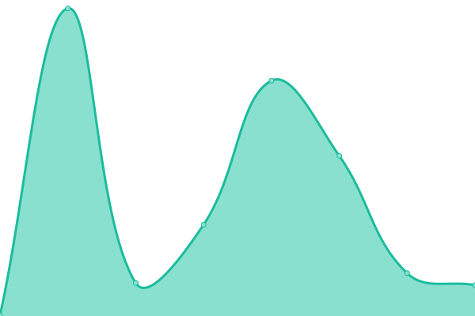

# [📈 Live Status](https://status.purosandbox.com): <!--live status--> **🟩 All systems operational**

This repository contains the open-source uptime monitor and status page for [Puro.earth](https://puro.earth/), powered by [Upptime](https://github.com/upptime/upptime).

With [Upptime](https://upptime.js.org), you can get your own unlimited and free uptime monitor and status page, powered entirely by a GitHub repository. We use [Issues](https://github.com/puro-earth/status/issues) as incident reports, [Actions](https://github.com/puro-earth/status/actions) as uptime monitors, and [Pages](https://status.purosandbox.com) for the status page.

<!--start: status pages-->
<!-- This summary is generated by Upptime (https://github.com/upptime/upptime) -->
<!-- Do not edit this manually, your changes will be overwritten -->
<!-- prettier-ignore -->
| URL | Status | History | Response Time | Uptime |
| --- | ------ | ------- | ------------- | ------ |
|  [Puro.earth](https://puro.earth) | 🟩 Up | [puro-earth.yml](https://github.com/puro-earth/status/commits/HEAD/history/puro-earth.yml) | 

 1008ms
     
 | 

<a href="https://status.purosandbox.com/history/puro-earth">100.00%</a>
    

|  [Puro.earth Registry](https://registry.puro.earth) | 🟩 Up | [puro-earth-registry.yml](https://github.com/puro-earth/status/commits/HEAD/history/puro-earth-registry.yml) | 

 3096ms
     
 | 

<a href="https://status.purosandbox.com/history/puro-earth-registry">100.00%</a>
    

|  [Puro.earth Portal](https://my.puro.earth/) | 🟩 Up | [puro-earth-portal.yml](https://github.com/puro-earth/status/commits/HEAD/history/puro-earth-portal.yml) | 

 1291ms
     
 | 

<a href="https://status.purosandbox.com/history/puro-earth-portal">100.00%</a>
    

|  Puro.earth Registry Services API | 🟩 Up | [puro-earth-registry-services-api.yml](https://github.com/puro-earth/status/commits/HEAD/history/puro-earth-registry-services-api.yml) | 

 454ms
     
 | 

<a href="https://status.purosandbox.com/history/puro-earth-registry-services-api">100.00%</a>
    

|  Puro.earth Sales Channel Management Services API | 🟩 Up | [puro-earth-sales-channel-management-services-api.yml](https://github.com/puro-earth/status/commits/HEAD/history/puro-earth-sales-channel-management-services-api.yml) | 

 444ms
     
 | 

<a href="https://status.purosandbox.com/history/puro-earth-sales-channel-management-services-api">100.00%</a>
    

|  Puro.earth Sales Channel Services API | 🟩 Up | [puro-earth-sales-channel-services-api.yml](https://github.com/puro-earth/status/commits/HEAD/history/puro-earth-sales-channel-services-api.yml) | 

 478ms
     
 | 

<a href="https://status.purosandbox.com/history/puro-earth-sales-channel-services-api">100.00%</a>
    

|  [Puro.earth Sales Channel Services API Documentation](https://docs.api.puro.earth/) | 🟩 Up | [puro-earth-sales-channel-services-api-documentation.yml](https://github.com/puro-earth/status/commits/HEAD/history/puro-earth-sales-channel-services-api-documentation.yml) | 

 123ms
     
 | 

<a href="https://status.purosandbox.com/history/puro-earth-sales-channel-services-api-documentation">100.00%</a>
    

|  Puro.earth Registry Services API (Staging) | 🟩 Up | [puro-earth-registry-services-api-staging.yml](https://github.com/puro-earth/status/commits/HEAD/history/puro-earth-registry-services-api-staging.yml) | 

 474ms
     
 | 

<a href="https://status.purosandbox.com/history/puro-earth-registry-services-api-staging">100.00%</a>
    

|  Puro.earth Sales Channel Management Services API (Staging) | 🟩 Up | [puro-earth-sales-channel-management-services-api-staging.yml](https://github.com/puro-earth/status/commits/HEAD/history/puro-earth-sales-channel-management-services-api-staging.yml) | 

 468ms
     
 | 

<a href="https://status.purosandbox.com/history/puro-earth-sales-channel-management-services-api-staging">100.00%</a>
    

|  Puro.earth Sales Channel Services API (Staging) | 🟩 Up | [puro-earth-sales-channel-services-api-staging.yml](https://github.com/puro-earth/status/commits/HEAD/history/puro-earth-sales-channel-services-api-staging.yml) | 

 470ms
     
 | 

<a href="https://status.purosandbox.com/history/puro-earth-sales-channel-services-api-staging">100.00%</a>
    

<!--end: status pages-->

[**Visit our status website →**](https://status.purosandbox.com)

## 📄 License

- Powered by: [Upptime](https://github.com/upptime/upptime)
- Code: [MIT](./LICENSE) © [Puro.earth](https://puro.earth/)
- Data in the `./history` directory: [Open Database License](https://opendatacommons.org/licenses/odbl/1-0/)
